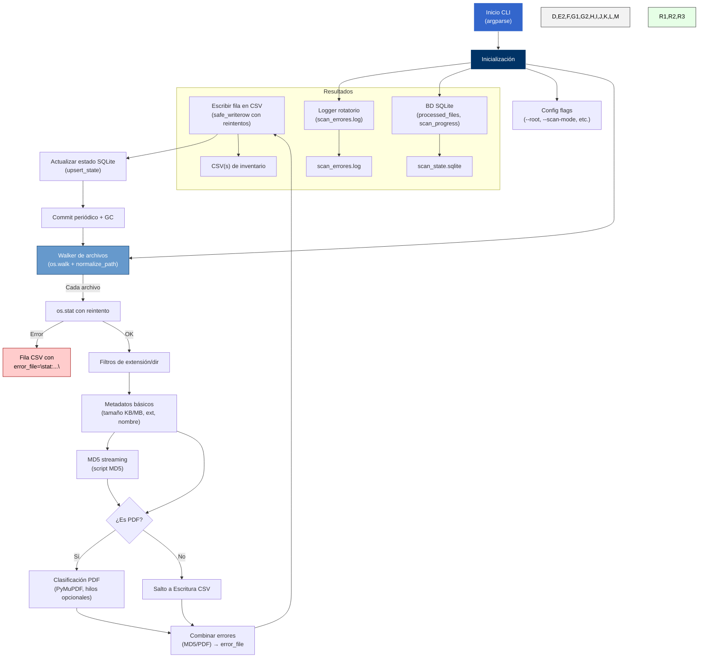

# ANH Manager File

Este repositorio contiene dos scripts de Python para el escaneo, inventario y clasificación de grandes estructuras de archivos en unidades de red UNC de Windows.  Están pensados para ayudar a la **Agencia Nacional de Hidrocarburos (ANH)** en tareas de auditoría, migración y depuración de datos en el proyecto **Banco de Información Energética (BIEN)**, permitiendo generar inventarios técnicos detallados, detectar duplicados y evaluar el estado de los documentos almacenados.

## Introducción

Los scripts `scan_file_anh_lotes_reiniciar.py` y `scan_file_anh_lotes_reiniciar_md5.py` recorren recursivamente una ruta UNC, listan cada archivo, calculan sus metadatos básicos y los vuelcan a un archivo CSV.  La variante MD5 calcula, además, la huella digital de cada archivo e incorpora una columna `error_file` con los mensajes de error registrados durante el proceso.  Ambos programas soportan reanudación mediante una base de datos SQLite, clasifican PDFs según contengan texto o sólo imagen y generan un log rotatorio de eventos y fallos.

El objetivo es automatizar la inspección de grandes volúmenes de información técnica y documental, proporcionando un inventario exhaustivo que facilite la toma de decisiones y la planeación de cargas hacia nuevos repositorios.  En el contexto del BIEN, los datos a migrar incluyen información sísmica, pozos, proyectos petrotécnicos, documentos digitales, imágenes, modelos y otros archivos técnicos, con un volumen estimado inicial de 900 TB【315†ANH-GCO-FR-123†L18-L24】.  Disponer de un inventario preciso, con clasificación por tipo de PDF y detección de duplicados, acelera la migración y mejora la calidad de los datos transferidos.

## Características principales

- **Escaneo exhaustivo**: Recorrido recursivo de directorios UNC extensos (soporte de rutas largas `\\?\\UNC\…`).
- **Reanudación**: Uso de SQLite (`processed_files`, `scan_progress`) para almacenar el progreso del escaneo y evitar reprocesar archivos ya inventariados.
- **Clasificación de PDFs**: Distingue si un PDF contiene texto (`PDF_imagen="0"`) o solo imágenes (`PDF_imagen="1"`) analizando las primeras páginas con PyMuPDF.
- **Cálculo de MD5** (versión MD5): Genera una huella digital de cada archivo en streaming para detectar duplicados sin cargar el archivo completo en memoria.
- **Exportación en CSV**: Cada archivo genera una fila con extensión, tamaños en KB/MB, ruta relativa, nombre, clasificación, MD5 y mensaje de error (si aplica).  En modo por topdir se crea un CSV por subcarpeta de primer nivel; en modo "all" un único CSV global.
- **Registro robusto de errores**: La columna `error_file` y el log rotatorio registran fallos de acceso, lectura, MD5 o clasificación PDF; el proceso continúa con los demás archivos.
- **Filtros de extensiones y exclusión de directorios**: Se pueden incluir o excluir extensiones y carpetas específicas para focalizar el escaneo.

## Casos de uso

- **Generar inventarios técnicos** antes de migrar datos al BIEN, documentando qué archivos existen y en qué estado se encuentran.
- **Detectar duplicados** mediante la columna MD5 para limpiar información redundante.
- **Identificar PDFs no interpretables** (sin texto) que requieren OCR antes de la ingesta.
- **Auditar información incompleta** o inaccesible a través de los mensajes de `error_file`.

## Beneficios

El uso de estos scripts permite automatizar una tarea que de otra manera sería manual y lenta.  Al registrar todos los archivos y errores encontrados, se obtiene una imagen completa del repositorio sin omisiones.  La reanudación con SQLite evita pérdidas de tiempo en reprocesado y proporciona trazabilidad.  La clasificación PDF y el cálculo de MD5 incrementan el valor del inventario al destacar archivos que requieren acciones específicas (OCR, eliminación de duplicados).  Todo ello se integra en un flujo que puede ejecutarse de forma programada, con control de concurrencia y bajo uso de memoria.

## Limitaciones

Estos scripts están diseñados para entornos Windows y rutas UNC.  Requieren Python 3.10 o superior, y la instalación previa de PyMuPDF (`pymupdf`) para la clasificación PDF.  No incluyen herramientas de visualización de los resultados, ni mueven ni modifican archivos.  El cálculo de MD5 puede ser costoso en entornos con E/S limitada.

## Requisitos y dependencias

### Hardware y sistema

- PC con Windows 10/11 y acceso a los directorios UNC que se van a escanear.
- Espacio suficiente para los CSV generados y la base SQLite (varios cientos de MB en grandes inventarios).

### Software

- Python 3.10 o superior.
- Librerías estándar (`sqlite3`, `argparse`, `concurrent.futures`, etc.).
- [PyMuPDF](https://pymupdf.readthedocs.io/) (opcional pero recomendable) para la detección de texto en PDFs: `pip install pymupdf`.

## Instalación

1. Clona este repositorio o descarga los scripts.  Desde una consola PowerShell o CMD:

   ```cmd
   git clone https://github.com/vmondrag/anh_manager_file.git
   cd anh_manager_file
   ```

2. Crea un entorno virtual (opcional) e instala PyMuPDF:

   ```cmd
   python -m venv venv
   venv\Scripts\activate
   pip install pymupdf
   ```

3. Ajusta las rutas por defecto en los argumentos de ejecución o pásalas por línea de comandos.

## Uso

### Modo por subcarpetas de primer nivel (`per-topdir`)

Escanea cada subcarpeta de primer nivel bajo la raíz y genera un CSV por carpeta:

```cmd
python scan_file_anh_lotes_reiniciar_md5.py \
  --scan-mode per-topdir \
  --root "\\\\?\\UNC\\gg.anh.gov.co\\RepositorioGG" \
  --out "C:\ANH\ANH5\salida_scanar_full.csv" \
  --state "C:\ANH\ANH5\scan_state.sqlite" \
  --log "C:\ANH\ANH5\scan_errores.log" \
  --workers 8 \
  --pdf-pages 1 \
  --progress-every 500
```

La salida será un CSV por cada carpeta en la ruta dada.  Puede personalizarse la lista de carpetas con `--topdirs` y filtrar extensiones con `--include-ext` y `--exclude-ext`.

### Modo global (`all`)

Genera un único CSV con todo el árbol de archivos:

```cmd
python scan_file_anh_lotes_reiniciar_md5.py \
  --scan-mode all \
  --root "\\\\?\\UNC\\gg.anh.gov.co\\RepositorioGG" \
  --out "C:\ANH\ANH5\salida_scanar_full.csv"
```

### Reanudación y reseteo

El progreso se almacena en `scan_state.sqlite`.  Para reiniciar completamente:

```cmd
python scan_file_anh_lotes_reiniciar_md5.py --reset-state --fresh ...
```

Para reescaneo selectivo de ciertas carpetas finalizadas:

```cmd
python scan_file_anh_lotes_reiniciar_md5.py --rescan-finished "1_INFORMACION_QC,2_DESCARGAS"
```

## Arquitectura y diseño

### Diagrama de alto nivel (Mermaid)



### Componentes clave

- **normalize_path**: Convierte rutas locales y UNC a formato extendido y valida componentes.
- **safe_writerow**: Escribe al CSV con reintentos y gestiona errores de bloqueo.
- **file_md5**: Calcula MD5 por bloques para no cargar archivos grandes en memoria.
- **classify_pdf_with_error**: Usa PyMuPDF para detectar si un PDF contiene texto y captura errores.
- **processed_files**: Tabla SQLite que almacena `path_abs`, `size_bytes`, `mtime_ns`, `written_ts` y evita reprocesar archivos iguales.
- **scan_progress**: Tabla SQLite que marca carpetas de primer nivel finalizadas para reanudar en modo `per-topdir`.

Para más detalles de la arquitectura, decisiones de diseño y lógica de manejo de errores, consulta el documento de [Documentación Técnica](./docs/TECHNICAL.md) en este repositorio.

## Estructura del repositorio

```
anh_manager_file/
├── README.md          # Introducción, manual de usuario y diagrama
├── docs/
│   └── TECHNICAL.md   # Documentación técnica completa (arquitectura y algoritmos)
├── scan_file_anh_lotes_reiniciar.py      # Versión sin MD5
├── scan_file_anh_lotes_reiniciar_md5.py  # Versión con MD5 y error_file
└── .gitignore        # Exclusiones comunes (virtualenv, logs, etc.)
```

## Licencia

Este proyecto se publica bajo la licencia MIT.  Consulta el archivo [LICENSE](./LICENSE) para más detalles.
